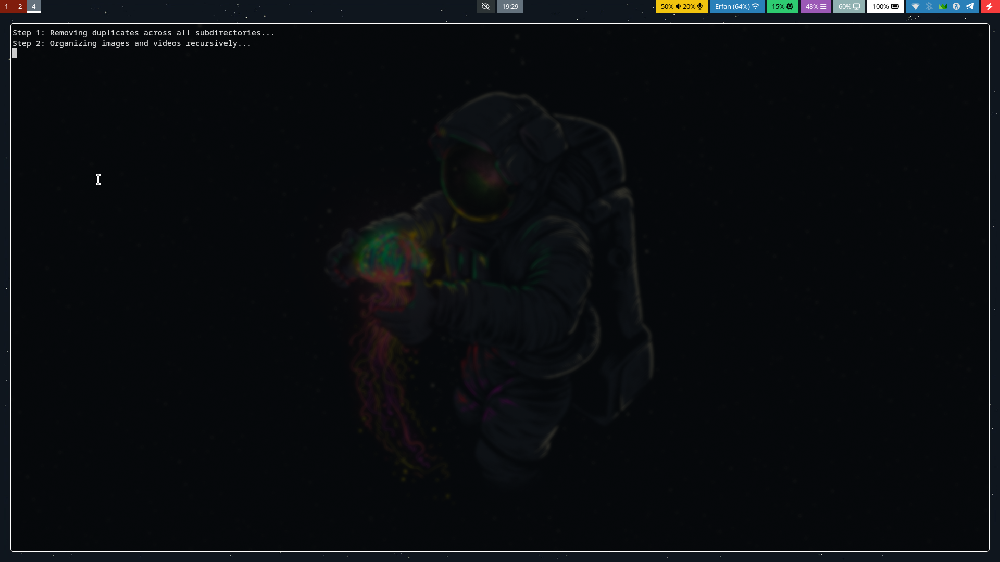
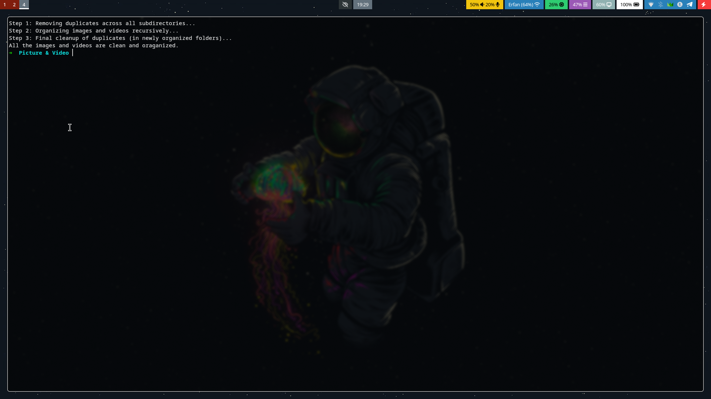

# SnapSort Image and Video Sorter

An image and video sorter in date & duplicate remover in bash script.

## Screenshots

Here are some screenshots of the setup:

 



## Requirements

Before running the installer, make sure you already have:

- A properly installed **GNU/Linux system**
- **fdupes** Installed with your distro package manager

## Installation

1) Clone the repository:

```bash
git clone https://github.com/erfanmousavi-dev/snapsort.git
```

2) Enter the directory:

```bash
cd snapsort
```

3) Make the script executable:

```bash
chmod +x main.sh
```

4) Run the script as a normal user:

```bash
./main.sh
```

(Do NOT run the script as root or with sudo.)


If you liked the script, feel free to give the project a ⭐ on GitHub :)